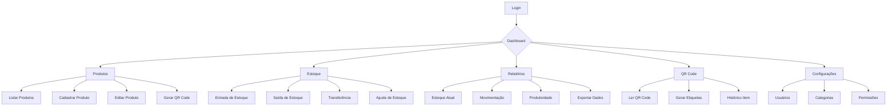

## 1. Visão Geral do Produto

Sistema de controle de estoque especializado para empresa de totens de pesquisa, permitindo gestão completa de produtos, componentes e insumos utilizados na montagem e manutenção de totens interativos. O sistema atende às necessidades específicas do setor, incluindo serialização de ativos, rastreamento por QR codes, e gestão de diferentes estados de produtos (novos, usados, RB, ativo).

**Problemas resolvidos:**
- Falta de controle sobre peças e componentes dispersos
- Dificuldade no rastreamento de ativos serializados
- Gestão manual ineficiente de estoque
- Ausência de relatórios gerenciais em tempo real

**Público-alvo:** Equipes de operações, técnicos de campo, administradores e gestores da empresa de totens.

## 2. Funcionalidades Principais

### 2.1 Papéis de Usuário

| Papel | Método de Registro | Permissões Principais |
|-------|-------------------|----------------------|
| Administrador | Convite interno | Acesso total ao sistema, configurações, relatórios completos |
| Gerente | Convite interno | Gestão de estoque, relatórios, cadastro de produtos |
| Técnico | Convite interno | Movimentação de estoque, leitura de QR codes, atualização de status |
| Visualizador | Convite interno | Apenas visualização de relatórios e dashboard |

### 2.2 Módulos do Sistema

O sistema de controle de estoque consiste nos seguintes módulos principais:

1. **Dashboard**: Visão geral com KPIs, gráficos de movimentação e alertas de estoque
2. **Gestão de Produtos**: Cadastro, edição e categorização de todos os tipos de itens
3. **Movimentação de Estoque**: Entradas, saídas, transferências entre locais
4. **Serialização e QR Codes**: Geração e leitura de códigos para rastreamento
5. **Relatórios**: Análises detalhadas, exportações e indicadores de performance
6. **Importação/Exportação**: Migração de dados em massa via Excel/CSV
7. **Configurações**: Parâmetros do sistema, usuários e permissões

### 2.3 Detalhamento de Funcionalidades por Página

| Página | Módulo | Descrição das Funcionalidades |
|--------|--------|-------------------------------|
| Login | Autenticação | Validar credenciais, recuperar senha, manter sessão ativa |
| Dashboard | Visão Geral | Exibir KPIs principais (valor total, itens em estoque, movimentações do dia), gráficos de tendências, alertas de estoque mínimo |
| Dashboard | Alertas | Notificar sobre produtos abaixo do estoque mínimo, vencimentos de garantia, itens em manutenção |
| Produtos | Listagem | Visualizar todos os produtos com filtros por categoria, status, localização, busca avançada |
| Produtos | Cadastro | Criar novo produto com campos específicos por categoria (totem, insumo, peça, tablet), definir estoque mínimo, upload de fotos |
| Produtos | Edição | Modificar informações, alterar status (novo/usado/RB/ativo), registrar número de série, gerar QR code |
| Produtos | Serialização | Gerar QR code único para cada item serializado, impressão de etiquetas, histórico de movimentações |
| Estoque | Entrada | Registrar entrada de produtos com nota fiscal, fornecedor, quantidade e valor unitário |
| Estoque | Saída | Registrar saída com destino, responsável, quantidade, motivo (venda, manutenção, transferência) |
| Estoque | Transferência | Mover produtos entre locais (matriz, filial, obra), manter histórico de movimentações |
| Estoque | Ajuste | Corrigir quantidades com justificativa, aprovação de administrador para grandes variações |
| QR Code | Leitura | Escaneamento via câmera ou leitor, exibir informações completas do produto, histórico de movimentações |
| QR Code | Geração | Criar código único para cada item, customizar layout da etiqueta, impressão em lote |
| Relatórios | Estoque Atual | Listar posição atual por categoria, localização, valor total, quantidades |
| Relatórios | Movimentação | Análise de entradas e saídas por período, produto, responsável, gráficos de tendência |
| Relatórios | Produtividade | Itens mais movimentados, tempo de giro, análise ABC, sugestões de compras |
| Relatórios | Manutenção | Itens em manutenção, custos, tempo médio, peças mais substituídas |
| Importação | Template | Download de planilha modelo com campos obrigatórios, validação de dados antes da importação |
| Importação | Processamento | Upload de arquivo Excel/CSV, mapeamento de campos, preview de dados, confirmação de importação |
| Exportação | Dados | Exportar relatórios em Excel/PDF, selecionar colunas, aplicar filtros, agendar exportações |
| Configurações | Usuários | Criar/editar usuários, definir permissões, redefinir senhas, histórico de acessos |
| Configurações | Sistema | Definir estoques mínimos padrão, moeda, fuso horário, integrações, backup automático |
| Configurações | Categorias | Criar hierarquia de categorias, definir atributos específicos, regras de negócio por tipo |

## 3. Fluxos de Operação Principal

### Fluxo de Entrada de Produtos
1. Usuário acessa módulo de Estoque > Entrada
2. Seleciona fornecedor ou cadastra novo
3. Escaneia nota fiscal ou digita dados manualmente
4. Adiciona produtos um por um ou via importação
5. Define quantidades e valores unitários
6. Confere e confirma entrada
7. Sistema gera protocolo e atualiza estoque

### Fluxo de Serialização
1. No cadastro de produto, marca opção "Serializado"
2. Sistema gera QR code único automaticamente
3. Usuário imprime etiqueta
4. Aplica etiqueta no produto físico
5. A partir deste momento, todo movimento requer leitura do QR code

### Fluxo de Consulta por QR Code
1. Técnico escaneia QR code no totem ou peça
2. Sistema exibe informações completas do item
3. Mostra histórico de movimentações
4. Permite registrar nova movimentação
5. Atualiza localização e responsável automaticamente

## 4. Interface do Usuário

### 4.1 Estilo de Design

- **Cores principais**: Azul corporate (#1E40AF) e cinza claro (#F3F4F6)
- **Cores secundárias**: Verde para sucesso (#10B981), vermelho para alertas (#EF4444)
- **Botões**: Estilo arredondado com sombra suave, hover effects
- **Fontes**: Inter para textos, Roboto Mono para códigos e números
- **Layout**: Card-based com navegação lateral fixa
- **Ícones**: Material Design Icons, consistentes e intuitivos

### 4.2 Elementos por Página

| Página | Módulo | Elementos de UI |
|--------|--------|----------------|
| Dashboard | Cards KPI | Cards coloridos com ícones grandes, números em destaque, variação percentual |
| Dashboard | Gráficos | Gráficos de linha para tendências, pizza para categorias, barras para comparações |
| Produtos | Tabela | Colunas fixas para ações, ordenação por clique, paginação, filtros inline |
| Produtos | Formulário | Campos agrupados por seção, validação em tempo real, preview de imagem |
| QR Code | Leitor | Área de escaneamento grande, feedback visual por cor, som de confirmação |
| Estoque | Movimento | Formulário em etapas, validação de campos obrigatórios, preview antes de confirmar |
| Relatórios | Filtros | Date picker, select múltiplo, busca com autocomplete, botão de limpar filtros |

### 4.3 Responsividade

- **Desktop-first**: Otimizado para telas grandes (1366px+)
- **Mobile-adaptativo**: Layout adaptável para tablets e smartphones
- **Touch-friendly**: Botões grandes para uso com luvas em ambiente de obra
- **Offline support**: Cache de dados essenciais para funcionamento sem internet
- **Impressão**: Estilos dedicados para impressão de etiquetas e relatórios

## 5. Regras de Negócio

### 5.1 Estados de Produtos

- **Novo**: Produto zero km, nunca utilizado, garantia integral
- **Usado**: Produto em uso ou com histórico de uso, sem garantia
- **RB (Retorno de Baixa)**: Produto que voltou de campo, precisa de avaliação
- **Ativo**: Produto instalado e funcionando em cliente

### 5.2 Movimentações

- Entradas sempre aumentam estoque disponível
- Saídas diminuem estoque e registram destino/responsável
- Transferências mantêm estoque total mas alteram localização
- Ajustes requerem aprovação para variações superiores a 10%

### 5.3 Validações

- Números de série únicos no sistema
- QR codes não podem ser duplicados
- Produtos com status "Ativo" não podem ser movimentados
- Estoque não pode ficar negativo
- Produtos em manutenção não aparecem