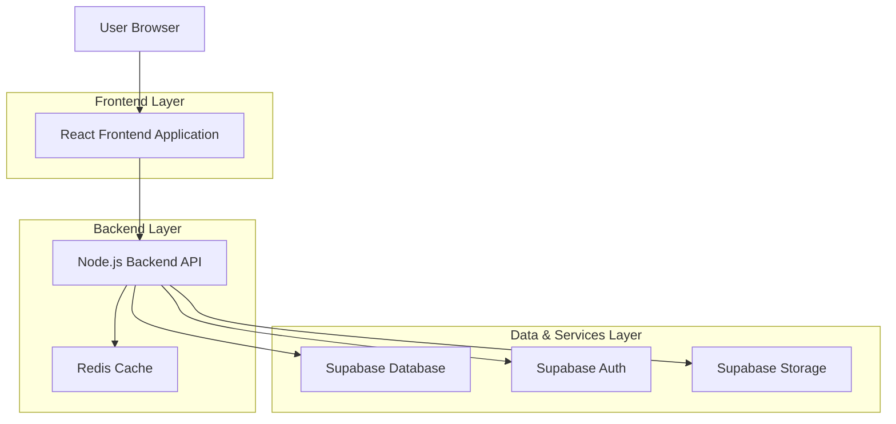
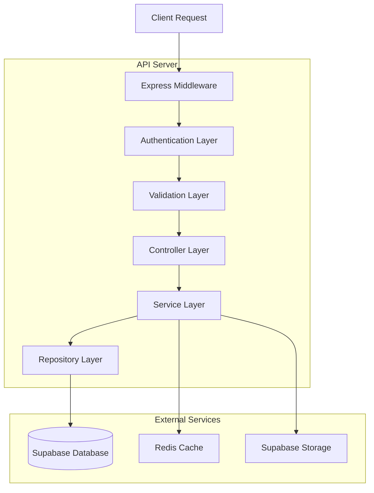
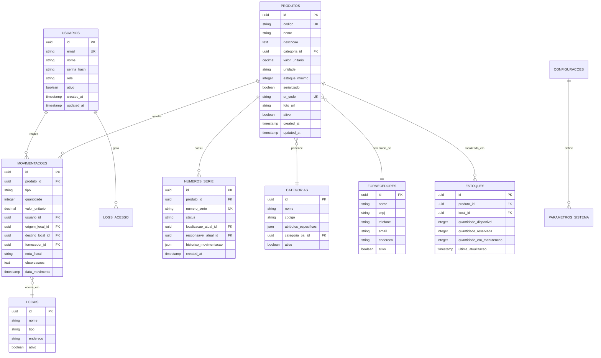

## 1. Arquitetura do Sistema



## 2. Stack Tecnológico

- **Frontend**: React@18 + TypeScript + Vite + TailwindCSS@3
- **Backend**: Node.js@20 + Express@4 + TypeScript
- **Banco de Dados**: Supabase (PostgreSQL@15)
- **Autenticação**: Supabase Auth (JWT)
- **Cache**: Redis@7
- **Storage**: Supabase Storage (para imagens e documentos)
- **QR Code**: qrcode@1 + jsQR para leitura
- **Planilhas**: SheetJS para importação/exportação Excel

## 3. Definições de Rotas

### Frontend Routes
| Rota | Propósito |
|------|-----------|
| / | Login page |
| /dashboard | Dashboard principal com KPIs e alertas |
| /produtos | Listagem e gestão de produtos |
| /produtos/novo | Cadastro de novo produto |
| /produtos/:id | Detalhes e edição de produto |
| /estoque/entrada | Registro de entrada de produtos |
| /estoque/saida | Registro de saída de produtos |
| /estoque/transferencia | Transferência entre locais |
| /qr-code | Leitura e geração de QR codes |
| /relatorios | Central de relatórios |
| /relatorios/estoque-atual | Relatório de posição de estoque |
| /relatorios/movimentacao | Relatório de movimentação |
| /configuracoes/usuarios | Gestão de usuários |
| /configuracoes/sistema | Configurações gerais |
| /configuracoes/categorias | Gestão de categorias |

### Backend API Routes
| Rota | Método | Propósito |
|------|--------|-----------|
| /api/auth/login | POST | Autenticação de usuário |
| /api/auth/logout | POST | Logout do sistema |
| /api/auth/refresh | POST | Refresh token |
| /api/produtos | GET | Listar produtos com filtros |
| /api/produtos | POST | Criar novo produto |
| /api/produtos/:id | GET | Obter detalhes do produto |
| /api/produtos/:id | PUT | Atualizar produto |
| /api/produtos/:id | DELETE | Remover produto |
| /api/estoque/movimento | POST | Registrar movimentação |
| /api/estoque/transferencia | POST | Transferir entre locais |
| /api/estoque/ajuste | POST | Ajustar quantidade |
| /api/qr-code/generate | POST | Gerar QR code |
| /api/qr-code/read | POST | Ler QR code |
| /api/relatorios/estoque | GET | Relatório de estoque |
| /api/relatorios/movimentacao | GET | Relatório de movimentação |
| /api/importacao/produtos | POST | Importar produtos via Excel |
| /api/exportacao/relatorios | GET | Exportar relatórios |

## 4. Definições de API

### 4.1 Autenticação

```typescript
POST /api/auth/login
```

Request:
```json
{
  "email": "usuario@empresa.com",
  "password": "senha123"
}
```

Response:
```json
{
  "user": {
    "id": "uuid",
    "email": "usuario@empresa.com",
    "name": "João Silva",
    "role": "administrador"
  },
  "token": "jwt_token_here",
  "expiresIn": 3600
}
```

### 4.2 Produtos

```typescript
GET /api/produtos?categoria=totens&status=ativo&page=1&limit=20
```

Response:
```json
{
  "data": [
    {
      "id": "uuid",
      "codigo": "TOT-001",
      "nome": "Totem Survey Premium",
      "categoria": "totens",
      "quantidade": 15,
      "unidade": "unidade",
      "valor_unitario": 4500.00,
      "status": "novo",
      "localizacao": "matriz",
      "minimo_estoque": 5,
      "serializado": true,
      "qr_code": "unique_qr_code",
      "numero_serie": "NS123456",
      "foto_url": "https://storage.supabase.co/image.jpg",
      "created_at": "2024-01-15T10:00:00Z",
      "updated_at": "2024-01-15T10:00:00Z"
    }
  ],
  "total": 150,
  "page": 1,
  "totalPages": 8
}
```

### 4.3 Movimentação de Estoque

```typescript
POST /api/estoque/movimento
```

Request:
```json
{
  "tipo": "entrada",
  "produto_id": "uuid",
  "quantidade": 10,
  "valor_unitario": 4500.00,
  "fornecedor_id": "uuid",
  "nota_fiscal": "NF-12345",
  "observacoes": "Entrada de totens novos",
  "localizacao": "matriz"
}
```

## 5. Arquitetura do Servidor



## 6. Modelo de Dados

### 6.1 Diagrama ER



### 6.2 DDL - Data Definition Language

```sql
-- Tabela de Usuários
CREATE TABLE usuarios (
    id UUID PRIMARY KEY DEFAULT gen_random_uuid(),
    email VARCHAR(255) UNIQUE NOT NULL,
    nome VARCHAR(255) NOT NULL,
    senha_hash VARCHAR(255) NOT NULL,
    role VARCHAR(50) NOT NULL CHECK (role IN ('administrador', 'gerente', 'tecnico', 'visualizador')),
    ativo BOOLEAN DEFAULT true,
    ultimo_acesso TIMESTAMP WITH TIME ZONE,
    created_at TIMESTAMP WITH TIME ZONE DEFAULT NOW(),
    updated_at TIMESTAMP WITH TIME ZONE DEFAULT NOW()
);

-- Tabela de Categorias
CREATE TABLE categorias (
    id UUID PRIMARY KEY DEFAULT gen_random_uuid(),
    nome VARCHAR(255) NOT NULL,
    codigo VARCHAR(50) UNIQUE NOT NULL,
    descricao TEXT,
    atributos_especificos JSONB,
    categoria_pai_id UUID REFERENCES categorias(id),
    ativo BOOLEAN DEFAULT true,
    created_at TIMESTAMP WITH TIME ZONE DEFAULT NOW(),
    updated_at TIMESTAMP WITH TIME ZONE DEFAULT NOW()
);

-- Tabela de Produtos
CREATE TABLE produtos (
    id UUID PRIMARY KEY DEFAULT gen_random_uuid(),
    codigo VARCHAR(100) UNIQUE NOT NULL,
    nome VARCHAR(255) NOT NULL,
    descricao TEXT,
    categoria_id UUID NOT NULL REFERENCES categorias(id),
    valor_unitario DECIMAL(10,2) NOT NULL DEFAULT 0,
    unidade VARCHAR(20) NOT NULL DEFAULT 'unidade',
    estoque_minimo INTEGER DEFAULT 0,
    serializado BOOLEAN DEFAULT false,
    qr_code VARCHAR(255) UNIQUE,
    foto_url TEXT,
    ativo BOOLEAN DEFAULT true,
    created_at TIMESTAMP WITH TIME ZONE DEFAULT NOW(),
    updated_at TIMESTAMP WITH TIME ZONE DEFAULT NOW()
);

-- Tabela de Números de Série
CREATE TABLE numeros_serie (
    id UUID PRIMARY KEY DEFAULT gen_random_uuid(),
    produto_id UUID NOT NULL REFERENCES produtos(id),
    numero_serie VARCHAR(255) UNIQUE NOT NULL,
    status VARCHAR(50) NOT NULL DEFAULT 'disponivel' CHECK (status IN ('disponivel', 'em_uso', 'manutencao', 'danificado')),
    localizacao_atual_id UUID,
    responsavel_atual_id UUID REFERENCES usuarios(id),
    historico_movimentacao JSONB DEFAULT '[]',
    created_at TIMESTAMP WITH TIME ZONE DEFAULT NOW(),
    updated_at TIMESTAMP WITH TIME ZONE DEFAULT NOW()
);

-- Tabela de Locais
CREATE TABLE locais (
    id UUID PRIMARY KEY DEFAULT gen_random_uuid(),
    nome VARCHAR(255) NOT NULL,
    tipo VARCHAR(50) NOT NULL CHECK (tipo IN ('matriz', 'filial', 'obra', 'cliente', 'fornecedor')),
    endereco TEXT,
    ativo BOOLEAN DEFAULT true,
    created_at TIMESTAMP WITH TIME ZONE DEFAULT NOW()
);

-- Tabela de Estoques
CREATE TABLE estoques (
    id UUID PRIMARY KEY DEFAULT gen_random_uuid(),
    produto_id UUID NOT NULL REFERENCES produtos(id),
    local_id UUID NOT NULL REFERENCES locais(id),
    quantidade_disponivel INTEGER DEFAULT 0,
    quantidade_reservada INTEGER DEFAULT 0,
    quantidade_em_manutencao INTEGER DEFAULT 0,
    ultima_atualizacao TIMESTAMP WITH TIME ZONE DEFAULT NOW(),
    UNIQUE(produto_id, local_id)
);

-- Tabela de Movimentações
CREATE TABLE movimentacoes (
    id UUID PRIMARY KEY DEFAULT gen_random_uuid(),
    produto_id UUID NOT NULL REFERENCES produtos(id),
    tipo VARCHAR(50) NOT NULL CHECK (tipo IN ('entrada', 'saida', 'transferencia', 'ajuste')),
    quantidade INTEGER NOT NULL,
    valor_unitario DECIMAL(10,2),
    usuario_id UUID NOT NULL REFERENCES usuarios(id),
    origem_local_id UUID REFERENCES locais(id),
    destino_local_id UUID REFERENCES locais(id),
    fornecedor_id UUID,
    numero_serie_id UUID REFERENCES numeros_serie(id),
    nota_fiscal VARCHAR(100),
    observacoes TEXT,
    data_movimento TIMESTAMP WITH TIME ZONE DEFAULT NOW(),
    created_at TIMESTAMP WITH TIME ZONE DEFAULT NOW()
);

-- Tabela de Fornecedores
CREATE TABLE fornecedores (
    id UUID PRIMARY KEY DEFAULT gen_random_uuid(),
    nome VARCHAR(255) NOT NULL,
    cnpj VARCHAR(20) UNIQUE,
    telefone VARCHAR(50),
    email VARCHAR(255),
    endereco TEXT,
    ativo BOOLEAN DEFAULT true,
    created_at TIMESTAMP WITH TIME ZONE DEFAULT NOW(),
    updated_at TIMESTAMP WITH TIME ZONE DEFAULT NOW()
);

-- Índices para performance
CREATE INDEX idx_produtos_categoria ON produtos(categoria_id);
CREATE INDEX idx_produtos_ativo ON produtos(ativo);
CREATE INDEX idx_produtos_codigo ON produtos(codigo);
CREATE INDEX idx_numeros_serie_produto ON numeros_serie(produto_id);
CREATE INDEX idx_numeros_serie_status ON numeros_serie(status);
CREATE INDEX idx_movimentacoes_produto ON movimentacoes(produto_id);
CREATE INDEX idx_movimentacoes_tipo ON movimentacoes(tipo);
CREATE INDEX idx_movimentacoes_data ON movimentacoes(data_movimento);
CREATE INDEX idx_estoques_produto_local ON estoques(produto_id, local_id);

-- Permissões Supabase
GRANT SELECT ON ALL TABLES TO anon;
GRANT ALL PRIVILEGES ON ALL TABLES TO authenticated;

-- Dados iniciais
INSERT INTO categorias (nome, codigo, descricao) VALUES
('Totens', 'TOT', 'Totens de pesquisa completos'),
('Tablets', 'TAB', 'Tablets para totens'),
('Peças de Acrílico', 'ACR', 'Peças de acrílico para totens'),
('Insumos', 'INS', 'Materiais de consumo'),
('Ferramentas', 'FER', 'Ferramentas para montagem'),
('Peças de Reposição', 'REP', 'Peças para manutenção');

INSERT INTO locais (nome, tipo, endereco) VALUES
('Matriz', 'matriz', 'Rua Principal, 123 - Centro'),
('Filial Sul', 'filial', 'Av. Sul, 456 - Bairro Industrial'),
('Depósito Norte', 'filial', 'Rua Norte, 789 - Zona Norte');

INSERT INTO usuarios (email, nome, senha_hash, role) VALUES
('admin@empresa.com', 'Administrador', '$2b$10$hashed_password_here', 'administrador');
```

## 7. Configurações de Segurança

### 7.1 Autenticação JWT
- Tokens com validade de 1 hora
- Refresh tokens com validade de 7 dias
- Rate limiting de 100 requisições por minuto por IP
- CORS configurado para domínios específicos

### 7.2 Permissões por Role

```typescript
const permissions = {
  administrador: ['*'], // Todas as permissões
  gerente: [
    'produtos.read', 'produtos.write', 'produtos.delete',
    'estoque.write', 'estoque.read',
    'relatorios.read', 'relatorios.export',
    'usuarios.read'
  ],
  tecnico: [
    'produtos.read',
    'estoque.write', 'estoque.read',
    'qr-code.read', 'qr-code.write',
    'relatorios.read'
  ],
  visualizador: [
    'produtos.read',
    'estoque.read',
    'relatorios.read'
  ]
};
```

## 8. Performance e Escalabilidade

### 8.1 Cache Strategy
- Cache de produtos frequentemente acessados (TTL: 5 minutos)
- Cache de relatórios gerados (TTL: 30 minutos)
- Cache de estoque por local (TTL: 1 minuto)

### 8.2 Otimizações de Banco
- Índices em campos frequentemente consultados
- Particionamento de tabelas de movimentação por data
- Vacuum automático configurado
- Backup automático diário

### 8.3 Monitoramento
- Logs de acesso e erros
- Métricas de performance (tempo de resposta, queries lentas)
- Alertas de estoque baixo via webhook
- Dashboard de monitoramento em tempo real